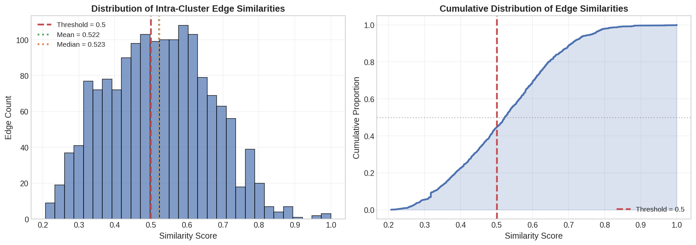
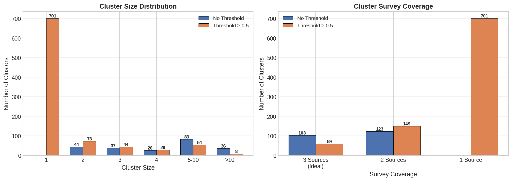
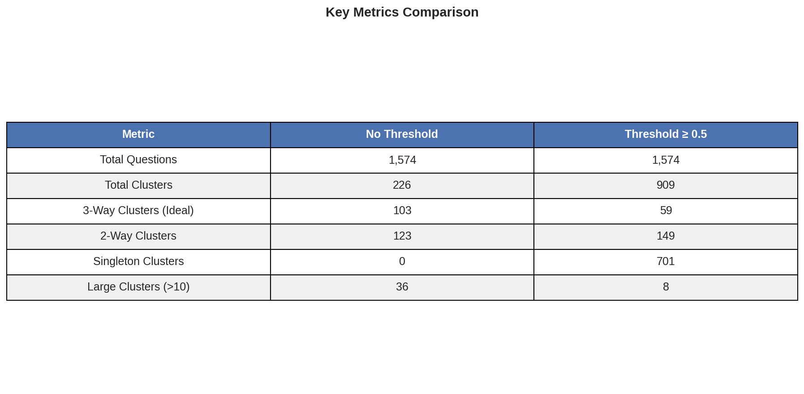
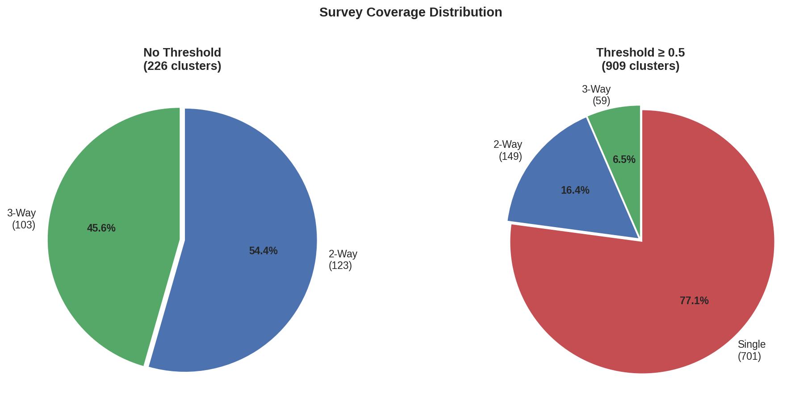

# Q2Q Transitive Cluster Analysis
## Technical Stakeholder Report

**Generated:** 2026-02-12
**Analysis Version:** 1.0
**Embedding Model:** sentence-transformers/all-MiniLM-L6-v2

---

## Executive Summary

This report presents findings from a **transitive cluster analysis** of 1,574 questionnaire items across three major health surveys: **Arivale** (561 questions), **Israeli10K** (514 questions), and **UK Biobank** (499 questions).

### Key Findings

| Finding | Impact |
|---------|--------|
| **103 three-way clusters** identified | Questions semantically equivalent across all three surveys |
| **226 total semantic clusters** (no threshold) | Significant reduction from 1,574 individual questions |
| **~45% of questions** have weak cross-survey equivalents | 701 singletons when filtered at similarity ≥ 0.5 |
| **36 large clusters** (>10 questions) require review | May indicate overly broad concept groupings |

### Recommendation

Use the **filtered dataset (threshold ≥ 0.5)** for high-confidence harmonization work, while consulting the **unfiltered dataset** to identify potential matches that may benefit from domain expert review.

---

## 1. Background & Motivation

### The Problem with Pairwise Matching

Traditional questionnaire harmonization identifies **pairwise matches** between surveys. However, this approach misses **transitive relationships**:

```
Example:
  A (Arivale: "Glaucoma") → B (Israeli10K: "Age glaucoma diagnosed")
  B (Israeli10K) → C (UKBB: "What was your age when glaucoma was first diagnosed?")

Result: {A, B, C} form a semantic cluster about "glaucoma diagnosis"
        even though A and C were never directly compared
```

### Our Approach: Graph-Based Transitive Clustering

We treat the questionnaire matching problem as a **graph connectivity** problem:

1. Each question is a **node** (1,574 total)
2. Each "best cross-source match" creates a **directed edge**
3. Convert to **undirected graph** (similarity is symmetric)
4. Find **connected components** using Union-Find algorithm
5. Connected components = **semantic clusters**

---

## 2. Data Overview

### Survey Composition

| Survey | Questions | Description |
|--------|-----------|-------------|
| **Arivale** | 561 | Wellness company health questionnaire |
| **Israeli10K** | 514 | Israeli 10K cohort study questionnaire |
| **UK Biobank** | 499 | UK Biobank assessment questionnaire |
| **Total** | **1,574** | Combined corpus for analysis |

### Edge Generation

For each of the 1,574 questions, we find its **single best semantic match** from the OTHER two surveys (cross-source matching). This produces exactly **1,574 directed edges**.

---

## 3. Similarity Score Analysis



### Statistical Summary

| Statistic | Value |
|-----------|-------|
| Minimum | 0.2071 |
| Maximum | 1.0000 |
| Mean | 0.5222 |
| Median | 0.5231 |
| Std Dev | 0.1428 |

### Percentile Distribution

| Percentile | Similarity |
|------------|------------|
| 10th | 0.33 |
| 25th | 0.42 |
| 50th (median) | 0.52 |
| 75th | 0.61 |
| 90th | 0.71 |
| 95th | 0.78 |
| 99th | 0.90 |

### Interpretation

- The **median similarity of 0.52** indicates that half of all cross-source matches have moderate-to-good semantic alignment
- The **long left tail** (min 0.21) shows some questions have no good cross-survey equivalent
- The **right tail reaching 1.0** confirms exact semantic matches exist (e.g., "Cardiac Catheterization")

---

## 4. Clustering Results

### Threshold Comparison

We analyzed clustering under two conditions:
1. **No threshold** - Include all 1,574 edges regardless of similarity
2. **Threshold ≥ 0.5** - Only include edges with similarity score ≥ 0.5



### Key Metrics



| Metric | No Threshold | Threshold ≥ 0.5 | Interpretation |
|--------|--------------|------------------|----------------|
| **Total Clusters** | 226 | 909 | Filtering breaks weak transitive chains |
| **3-Way Clusters** | 103 | 59 | 44 three-way clusters depend on weak edges |
| **2-Way Clusters** | 123 | 149 | Some split from larger clusters |
| **Single-Source** | 0 | 701 | 45% of questions have no good match |
| **Large (>10)** | 36 | 8 | Filtering reduces over-grouping |

### Survey Coverage Distribution



**No Threshold Analysis:**
- 103 clusters (45.6%) span all three surveys - these represent **ideal harmonization candidates**
- 123 clusters (54.4%) span exactly two surveys - partial coverage

**Filtered Analysis:**
- Only 59 clusters (6.5%) maintain three-way coverage with high confidence
- 701 questions (77.1%) become isolated singletons

---

## 5. Example Clusters

### High-Quality 3-Way Cluster: Glaucoma

| Survey | Question Text | Similarity |
|--------|---------------|------------|
| **Arivale** | "Glaucoma" | - |
| **Israeli10K** | "Which eye(s) affected by glaucoma" | 0.79 |
| **Israeli10K** | "Age glaucoma diagnosed" | 0.75 |
| **UKBB** | "What was your age when glaucoma was first diagnosed?" | 0.73 |
| **UKBB** | "Which eye(s) are affected by glaucoma?" | 0.79 |

**Cluster Average Similarity:** 0.776

This cluster demonstrates how **transitive chaining** discovers related questions that may not have been directly matched.

### High-Quality 3-Way Cluster: Type 1 Diabetes

| Survey | Question Text |
|--------|---------------|
| **Arivale** | "Type 1 diabetes" |
| **Arivale** | "Diabetes - Type 1" |
| **Israeli10K** | "Type 1 diabetes family number" |
| **UKBB** | "Did you start insulin within one year of your diagnosis of diabetes?" |

**Cluster Average Similarity:** 0.732

### Suspicious Large Cluster (Requires Review)

Some clusters contain >10 questions and may represent **overly broad semantic groupings**. These require domain expert review to determine if:
- The grouping is valid (e.g., all blood pressure-related questions)
- The grouping should be split into more specific subclusters
- A weak transitive edge incorrectly merged distinct concepts

---

## 6. Methodology Details

### Embedding Model

**Model:** `sentence-transformers/all-MiniLM-L6-v2`
- 384-dimensional embeddings
- Optimized for semantic similarity
- Fast inference (~1,500 embeddings/second)

### Cross-Source Matching

For each question in source survey S:
1. Build FAISS index of questions from OTHER surveys
2. Query index for nearest neighbor (cosine similarity via inner product on normalized vectors)
3. Store best match as directed edge: `S_question → Best_match`

### Union-Find Clustering

```python
class UnionFind:
    """O(α(n)) amortized operations with path compression and union by rank."""

    def find(self, x):
        # Path compression: flatten tree on lookup
        if self.parent[x] != x:
            self.parent[x] = self.find(self.parent[x])
        return self.parent[x]

    def union(self, x, y):
        # Union by rank: attach smaller tree under larger
        root_x, root_y = self.find(x), self.find(y)
        if self.rank[root_x] < self.rank[root_y]:
            self.parent[root_x] = root_y
        # ... (symmetric case and tie-breaker)
```

**Complexity:** O(n × α(n)) ≈ O(n) where α is the inverse Ackermann function

---

## 7. Output Files

| File | Description | Use Case |
|------|-------------|----------|
| `q2q_clusters_all.json` | Full clustering (no threshold) | Exploratory analysis |
| `q2q_clusters_all.tsv` | Flat TSV format | Spreadsheet review |
| `q2q_clusters_filtered.json` | Filtered (≥0.5 similarity) | High-confidence harmonization |
| `q2q_clusters_filtered.tsv` | Flat TSV format | Spreadsheet review |

### JSON Schema

```json
{
  "clusters": [
    {
      "cluster_id": 1,
      "size": 6,
      "sources": ["Arivale", "Israeli10K", "UKBB"],
      "num_sources": 3,
      "questions": [
        {"id": "...", "text": "...", "source": "..."}
      ],
      "edges": [
        {"from": "...", "to": "...", "similarity": 0.79}
      ],
      "avg_similarity": 0.776
    }
  ],
  "statistics": { ... }
}
```

---

## 8. Recommendations

### For Harmonization Teams

1. **Start with 3-way clusters** (103 in unfiltered, 59 in filtered) - these are the highest-value harmonization targets
2. **Review large clusters manually** - clusters with >10 questions may need splitting
3. **Use filtered dataset for automated pipelines** - similarity ≥ 0.5 provides reasonable confidence

### For Future Analysis

1. **Experiment with alternative thresholds** - 0.5 is a reasonable starting point but domain-specific tuning may improve results
2. **Consider hierarchical clustering** - for large clusters, sub-clustering may reveal finer-grained structure
3. **Validate with domain experts** - semantic similarity doesn't guarantee clinical/scientific equivalence

### Quality Criteria

| Quality Level | Criteria |
|---------------|----------|
| **Ideal** | 3 questions, one from each source, avg similarity ≥ 0.7 |
| **Good** | 2 questions from 2 sources, similarity ≥ 0.6 |
| **Acceptable** | 2+ questions, any source mix, similarity ≥ 0.5 |
| **Review Needed** | >5 questions OR similarity < 0.5 |

---

## 9. Limitations

1. **Semantic similarity ≠ clinical equivalence** - "Age diagnosed" vs "Year diagnosed" are semantically similar but may have different data formats
2. **Embedding model bias** - MiniLM was trained on general English text, not medical terminology
3. **Transitive chains can be fragile** - A single weak edge can incorrectly merge two distinct concept clusters
4. **No response option analysis** - This analysis only considers question text, not response scales or coding schemes

---

## Appendix A: Cluster Size Distribution

| Size | No Threshold | Filtered (≥0.5) |
|------|--------------|-----------------|
| 1 | 0 | 701 |
| 2 | 40 | 113 |
| 3 | 48 | 48 |
| 4 | 35 | 21 |
| 5-10 | 67 | 18 |
| >10 | 36 | 8 |

## Appendix B: Source Combination Coverage

### No Threshold

| Sources | Count |
|---------|-------|
| Arivale, Israeli10K, UKBB | 103 |
| Arivale, Israeli10K | 57 |
| Israeli10K, UKBB | 44 |
| Arivale, UKBB | 22 |

### Filtered (≥0.5)

| Sources | Count |
|---------|-------|
| Arivale, Israeli10K, UKBB | 59 |
| Arivale, Israeli10K | 65 |
| Israeli10K, UKBB | 54 |
| Arivale, UKBB | 30 |
| Single source (singletons) | 701 |

---

*Report generated by biovector-eval Q2Q cluster analysis pipeline*
